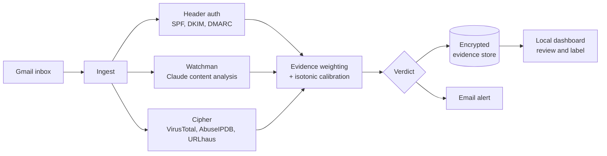

# SENTINEL

**An AI phishing analyst that shows its work.**

[](https://github.com/Jcapreol/sentinel/actions/workflows/ci.yml)


Most email security tools give you a verdict. SENTINEL gives you the evidence behind it.

It watches a live inbox, sends every new message through two independent AI and threat-intelligence agents, and turns their findings into a calibrated verdict. Every decision is stored as an encrypted evidence record you can open, review, label, and replay. When SENTINEL isn't sure, it says so instead of guessing.

---

## How it works



**Watchman** reads the message the way an analyst would: urgency, impersonation, mismatched links, requests for credentials.
**Cipher** checks every extracted indicator against three independent threat-intelligence feeds.
**Header analysis** parses SPF, DKIM, and DMARC results, including DMARC policy strength.

Each finding carries a weight and a direction. SENTINEL combines them, runs the result through a calibration model, and assigns one of four verdicts:

| Verdict | Meaning |
|---------|---------|
| **Malicious** | The evidence points to phishing |
| **Benign** | The evidence points to legitimate mail |
| **Deferred** | The evidence is weak or conflicting, so a human should look |
| **CoverageGap** | The message couldn't be analyzed, so no confidence is claimed |

---

## Design principles

**A clean lookup is not the same as no lookup.** "Checked, zero engines flagged it" is evidence of safety. "Nothing to check" is not. SENTINEL treats them differently.

**Suspicion is not proof.** Behavioral red flags alone are reported, never treated as confirmation.

**Never claim confidence you don't have.** Weak or conflicting evidence becomes `Deferred`. Missing evidence becomes `CoverageGap`. Neither gets a made-up score.

**Attacker-controlled data stays data.** Sender names, subjects, and message bodies are written by the attacker. They are escaped on render, sanitized before analysis, and never trusted to make decisions on their own.

**Fail loud.** If the pipeline stops working, SENTINEL tells you, even when the failure is in Gmail authentication itself.

---

## Features

### Autonomous triage
- Continuous polling, or one cycle per run for cron
- Gmail via personal OAuth or a Google Workspace service account
- Replay any stored verdict to see exactly how it would score today

### Encrypted evidence store
- Every record encrypted at rest with Fernet
- Findings, weights, directions, and verdicts preserved for review and audit
- Configurable retention and purge

### Alerting that people can read
- Email alerts at a configurable threshold (default: `Deferred` or worse)
- Written for a non-technical reader: what happened and what to do come first, technical detail comes after
- Built-in guard so SENTINEL never triages its own alerts and spirals into a loop

### Self-monitoring
- Heartbeat tracks every successful poll
- If nothing succeeds within the threshold (default 30 minutes), a liveness alert goes out over SMTP, which uses a separate credential from Gmail
- Alerts once on failure, not every cycle

### Analyst dashboard
- Verdict list with filters, summary counts, and live pipeline health
- Full evidence detail for every record
- Human labelling (confirmed phishing, confirmed benign, unclear) with encrypted notes, building ground truth over time
- Bound to `127.0.0.1` only, with dark theme and Eastern time display

### Alert triage CLI
A separate one-shot mode for SOC-style alerts. Paste a log line, alert, or IOC and get a corroborated verdict with MITRE ATT&CK mapping and named blind spots, as JSON or a Markdown incident report.

---

## Research: when authentication works against you

While running SENTINEL on live mail, I found phishing messages that passed SPF and DMARC cleanly and scored as safe, even though Watchman correctly flagged them.

The cause is structural. Valid authentication proves a sender controls their domain. It doesn't prove the domain is trustworthy. Attackers get there two ways:

- **Compromised accounts:** sending from a real organization's mailbox and borrowing its reputation.
- **Fresh domains:** registering a domain for about ten dollars, configuring authentication correctly, and sending. Two of the phishing domains I found were registered in the same second.

The full write-up traces the scoring math, shows why content analysis can't currently outvote clean authentication, and lays out what a fix needs to consider: [docs/findings/auth-alignment.md](docs/findings/auth-alignment.md).

---

## Quick start

Requires Python 3.10 or newer.

```bash
git clone https://github.com/Jcapreol/sentinel.git
cd sentinel
pip install -e .
cp .env.example .env    # add your API keys
```

> **Windows:** use `py -m pip install -e .` if `pip` is not on your PATH.

### Run phishing triage

```bash
sentinel-triage --once                 # one poll cycle, then exit
sentinel-triage                        # continuous loop
sentinel-triage --view                 # recent verdicts in the terminal
sentinel-triage --view --verdict Deferred --limit 50
sentinel-triage --replay MESSAGE_HASH  # rescore a stored verdict and diff it
sentinel-triage --test-alert           # verify alert delivery
```

### Open the dashboard

```bash
uvicorn sentinel.web.main:app --reload
# then open http://127.0.0.1:8000/verdicts
```

On a remote host, tunnel in over SSH:

```bash
ssh -L 8000:127.0.0.1:8000 user@your-host
```

### Triage a single alert

```bash
sentinel "Unusual outbound traffic to 185.220.101.45 on port 443 from prod-db-01"
sentinel --report "Sysmon Event ID 10: unsigned binary accessed lsass.exe"
echo "Brute force attempt from 185.220.101.45 on SSH" | sentinel
```

The demo page at `http://127.0.0.1:8000` runs five built-in scenarios with no API calls.

---

## Configuration

**Required for everything:**

| Variable | Source |
|----------|--------|
| `ANTHROPIC_API_KEY` | Anthropic (pay per use) |
| `VIRUSTOTAL_API_KEY` | VirusTotal (free tier) |
| `ABUSEIPDB_API_KEY` | AbuseIPDB (free tier) |
| `URLHAUS_API_KEY` | URLhaus, via auth.abuse.ch (free) |

**For `sentinel-triage`:**

| Variable | Purpose |
|----------|---------|
| `SENTINEL_EVIDENCE_KEY` | Fernet key for the evidence store |
| `GMAIL_AUTH_MODE` | `oauth` or `service_account` (default) |
| `GMAIL_MONITORED_MAILBOX` | Mailbox to triage |
| `SENTINEL_POLL_INTERVAL` | Seconds between polls in continuous mode |
| `SENTINEL_ALERT_ENABLED` | `true` to send verdict alerts |
| `SENTINEL_ALERT_THRESHOLD` | Lowest verdict that alerts (default `Deferred`) |
| `SENTINEL_ALERT_SMTP_*` | Host, port, username, password, recipient |
| `SENTINEL_ALERT_HEARTBEAT_THRESHOLD_MINUTES` | Liveness alert threshold (default 30) |

Setup guides: [Gmail](docs/gmail-setup.md) and [secrets, backup, and key rotation](docs/security.md).

---

## Engineering

- **900+ tests**, `mypy --strict`, and `ruff` on every push, across Python 3.10 and 3.12
- **Dependency scanning** with `pip-audit` in CI
- **Architecture enforced by tests:** the web layer is structurally blocked from opening the database or encryption key directly, and labelling code can't write to evidence records
- **Security tests for hostile input,** including stored XSS through sender names and injection through alert subjects
- **Calibrated confidence:** an isotonic calibration model, evaluated on a held-out set against an ECE, AUC-ROC, and deferral-rate release gate
- **Provider-agnostic mail layer:** a mail source interface with Gmail as the first implementation

SENTINEL is designed and directed by me and built with AI coding agents using the BMAD method. Every feature starts as a written story with acceptance criteria and goes through adversarial review before it ships.

---

## Known limitations

- **Authentication can outweigh content.** See the research section above.
- **Narrow calibration data.** The model was fit on one personal inbox plus a public phishing set, so results on business mail are unproven.
- **Gmail only.** Microsoft 365 support is planned on top of the existing mail source interface.
- **Live feeds shift.** Threat intelligence changes over time, so rescoring the same message can give different results. VirusTotal's free tier allows 4 requests per minute and 500 per day; past that, SENTINEL reports a blind spot and continues.
- **No dashboard authentication.** That's why it binds to loopback only.

---

## Data handling

The one-shot `sentinel` CLI writes nothing to disk. `sentinel-triage` stores encrypted evidence records on the local machine only. Data leaves the machine only to reach the Anthropic, VirusTotal, AbuseIPDB, and URLhaus APIs, plus your own SMTP server for alerts.

---

## Development

```bash
pip install -e . -r requirements-dev.txt
ruff check src/ tests/
mypy src/
pytest tests/
```

## About

Built by **Jackson Capreol**, a cybersecurity student in Tampa, Florida, focused on AI-driven detection and security automation. SENTINEL was built to run unattended and has been deployed on a Raspberry Pi, triaging real mail every five minutes.

## License

MIT. See [LICENSE](LICENSE).
